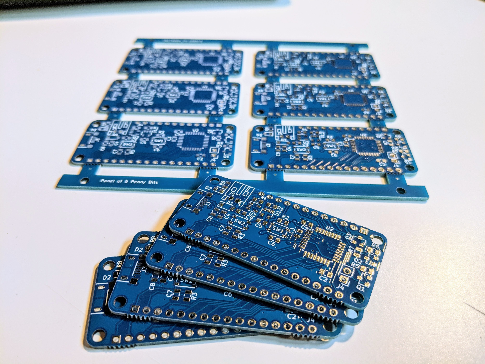

# PennyBIT

This borad is a very stripped-down feather style bord using a Cortex-M0 by ST. The main goal was to create a board with a BOM <$2.5 to use in everyday projects while still preserving the key functions of a Adafruit(R) Feather, like the LiPo Charger and the pinout. As a bonus, three of the pins are driven by MOSFETs e.g. to allow the use of RBG LED strips.

## Tech Spec
* STM32F042K6T Microcontroller
* MCP73831 LiPo Charger
* Built in USB-bootloader
* Access to SWD port
* Boot button, usable as user input in normal operation
* Pin compatible to Adafruit(R) Feather

## Current state
At the moment, the boards are being assembled and tested. Stay tuned for updates :smile:

### Note
The project was originally called "cheapFeather" so some files still carry this name.